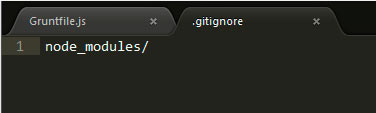

#Instalando o Grunt JS

Para que o Grunt funcione adequadamente, precisamos primeiramente instalar a sua interface CLI (*command line interface*). Dessa forma, você consegue rodar os comandos do grunt via terminal. Para isso, digite o comando abaixo

``` $ npm install -g grunt-cli ```

Em seguida, precisamos instalar o Grunt e incluí-lo na nossa lista de dependência de desenvolvimento no arquivo package.json. Para isso, tenha certeza que você está visualizando o diretório projetoWorkflow no seu terminal e digite:

``` $ npm install grunt --save-dev```

Feito isso, deverá acontecer duas coisas: A primeira é que foi criado um diretório chamado node_modules contendo o grunt. A segunda é que foi acrescentado no seu package.json as seguintes linhas:

```javascript

"devDependencies": {
    "grunt": "^0.4.5"
  }

```

## Instalando plugins do Grunt

O Grunt sozinho não faz nada sem os plugins (mentira, faz sim, mas por enquanto, aceite isso como uma verdade). Ou seja, precisamos instalar os plugins para rodar determinadas tarefas que você precisar. Há plugin pronto para quase tudo, e você poderá checar o site [http://gruntjs.com/plugins](http://gruntjs.com/plugins) para pesquisar coisas novas. 

[Num dos tópicos passado](https://tapmorales.gitbooks.io/workflow-front-end/content/turbinando-o-node/pensando-fora-do-browser.html), instalamos o uglify para minificar nosso js, lembra? Apenas para recordar, segue o comando para instalar o uglify:

``` 
$ npm install uglify-js 

```

Contudo, ao trabalharmos com o Grunt, não precisamos instalar o pacote acima para minificar nossos arquivos. Em contrapartida, precisamos instalar um ‘wrapper’ do próprio Grunt que envolve o pacote uglify e assim possibilita que executemos o comando uglify não mais pela linha de comando, mas sim programaticamente. É isso mesmo. Nós iremos escrever códigos javascript que rode comandos que antes só rodavam no terminal. Ou seja, vamos criar um arquivo javascript que contenha, por exemplo, uma chamada para “uglify”. Mas eu não estou falando de qualquer arquivo. Eu estou falando do Gruntfile.js.

## arquivo Gruntfile.js

Temos quase tudo de que precisamos. Resta agora criarmos, na raiz do nosso projeto, um arquivo chamado Gruntfile.js (mantenha a primeira letra maiúscula). Esse arquivo conterá as definições das tarefas que você criar. É a partir desse arquivo que o Grunt saberá quais tarefas executar. 

Mas antes de continuarmos, eu preciso que você instale todos os plugins necessários para executar as tarefas mencionadas anteriormente. Para isso, você irá digitar no terminal as seguintes linhas:

```
$ npm install grunt-autoprefixer --save-dev
$ npm install grunt-contrib-cssmin --save-dev
$ npm install grunt-contrib-uglify --save-dev
$ npm install grunt-contrib-copy --save-dev
$ npm install grunt-contrib-clean --save-dev


```

Da mesma forma que os pacotes instalados diretamente pelo terminal, os plugins do Grunt são copiados para dentro de node_modules. Dependendo do numero de plugins instalados, o diretório node_modules fica com um peso considerável. Por isso, acho uma boa prática não incluí-lo no versionamento. Lembre-se que o .gitignore está aí para isso.




Até aqui já temos o GruntJS e também alguns plugins intalados em nosso projeto. Vamos aprender no próximo tópico como configurar no Gruntfile.js.

