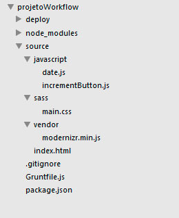

#Criando os arquivos estáticos

Esse tópico não apresentará nada de novo. Vamos criar os arquivo necessários para rodar as tarefas do Grunt. Então, simplesmente crie os seus arquivos no diretório ‘source’. Não se esqueça que precisaremos de um arquivo modernizr. 

Eu quis criar dois arquivos javascripts pra vermos como a concatenação deles funciona. Eu até que me esforcei para pensar em alguma funcionalidade que fosse simples, mas que não fosse banal. Depois de alguns minutos, desisti. Resolvi criar duas funcionalidades ~~idiotas~~ banais mesmo. Para os propósitos deste guia, satisfaz. 

Os arquivos javascripts estão divididos em módulos. Um mostra a data de hoje na tela (UAU!) e o outro mostra na tela quantas vezes o usuário clicou num botão (WOOWW).

O CSS foi criado com alguns detalhes de gradiente para vermos o autoprefixer em ação.

O meu HTML e CSS segue a metodologia BEM (Block, element, modifier) para estruturar minhas classes. Existem várias outras metodologias já criadas e discutidas. E você pode usar alguma delas, alterá-la ao seu modo ou simplesmente criar a sua própria metodologia. A ideia é criar um padrão, uma maneira de escrever códigos CSS que sejam reutilizáveis, escaláveis e elegantes. Não entrarei em detalhes sobre o BEM, mas garanto que é bem simples e que há vários materiais na internet para você consultar.


---


Se você é um profundo conhecedor de BEM, você perceberá uma pequena falha nos meus CSS’s. Não se preocupe com isso pois no momento oportuno eu retomarei esse assunto para corrigirmos isso. Saiba que esse “erro” é proposital e tem finalidades didáticas


---


Além disso, há mais uma coisa que preciso dizer: se você fizer o seu CSS exatamente igual ao meu, você verá que eu não me preocupei com o design da página. (Mentira. A verdade é que não sou um bom designer, e por isso sempre escolho tons de cinza. É mais difícil de errar).

Agora sim, segue a estrutura final e os códigos abaixo


####index.html

```html

<!doctype html>
<html lang="pt-br">
    <head>
        <meta charset="utf-8">
        <title>Exemplo de Task Runner</title>
        <script src="vendor/modernizr.min.js"></script>
        <link rel="stylesheet" href="sass/main.css">
    </head>
    <body>
        <header class="mainHeader">
            <h1 class="mainHeader__title">Exemplo de utilização do GruntJS</h1>    
        </header>

        <main role="main">

            <div class="dateContainer">
                <p class="dateContainer__content" id="containerDate"></p>
            </div>

            <div class="buttonsContainer">
                <button id="incrementButton" class="buttonsContainer__button">Clica para incrementar</button>
                <div id="resultIncrementButton" class="buttonsContainer__result">Clicado <span class="buttonsContainer__result--number js-result">0</span> vezes</div>
            </div>        
            

        </main>
        
        
        <script src="javascript/date.js"></script>
        <script src="javascript/incrementButton.js"></script>
    </body>
</html>


````


####sass/main.css

```css

body{
    background: #ccc;    
    font-family: arial, sans-serif;
}

.mainHeader{
    color: #bbb;
    text-shadow: 2px 2px 1px rgba(0,0,0,.6);
}

.buttonsContainer{
    border-top: 2px solid #A5A5A5;
}

.buttonsContainer .buttonsContainer__button{
    background-image: linear-gradient(to top, #848484, #AFAFAF);
    border: none;
    padding: 1em;
    margin: 1em 0;
    cursor: pointer;
    outline: none;
}

.buttonsContainer .buttonsContainer__button:hover{
    background-image: linear-gradient(to top, #AFAFAF, #848484);
}
.buttonsContainer .buttonsContainer__button:active{
    background-image: linear-gradient(to top, #868686, #565656);
}

.buttonsContainer .buttonsContainer__result--number{
    font-weight: bold;
}


````


####javascript/date.css

```javascript


/*
Mostra a data na tela
*/

;(function(){
    'use strict';
    var dateContainer = document.getElementById('containerDate');
    
    /* recupera a data e retorna na variavel dateInfo */
    var dateInfo = (function(){
        var today   = new Date()
        ,   mounth  = parseInt(today.getMonth() + 1).length < 2 ? parseInt(today.getMonth() + 1) : '0' + parseInt(today.getMonth() + 1)
        ,   date    = today.getDate() + '/' + mounth + '/' + today.getFullYear();

        console.log('a data que irá retornar é: '+ date);

        return date;
    })();

    // mostra a data na tela

    dateContainer.appendChild(document.createTextNode(dateInfo));
})();


````


####javascript/incrementButton.css

```javascript

/*
Conta quantos cliques no botão
*/

;(function(){
    'use strict';
    var botao         = document.getElementById('incrementButton')
    ,     container   = document.querySelector('.buttonsContainer__result .js-result')
    ,     count       = 0;

    var showQuant     = function(n){
        console.log('showQuant chamado recebendo: ' + n);
        // mostra a quantidade na tela
        container.firstChild.nodeValue = n;
    }

    showQuant(count);

    
    botao.addEventListener('click', function(e){
        showQuant(++count);
    })    
})();


````


Segue o link para download do modernizr: [http://modernizr.com/download/?-eventlistener-queryselector-rgba-textshadow-setclasses](http://modernizr.com/download/?-eventlistener-queryselector-rgba-textshadow-setclasses)

Segue a estrutura de arquivos do meu projeto para sua referência.




No próximo tópico, vamos iniciar a configuração de nosso gruntfile para executar as tarefas que havíamos planejado.

Te vejo no futuro!
