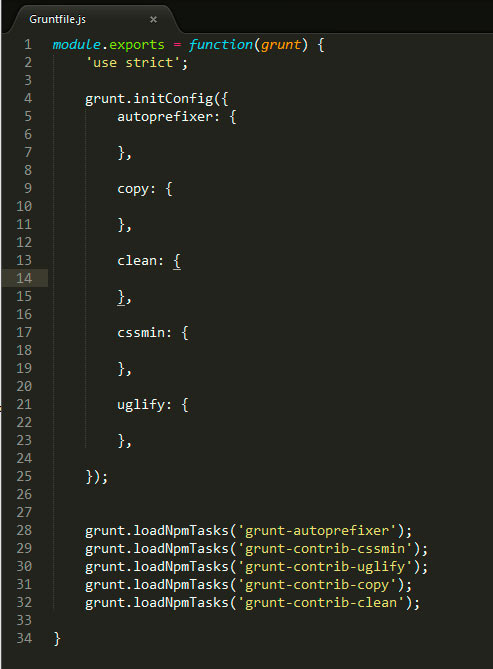

#Registrando tarefas no Gruntfile.js

Depois que tivermos todos os plugins instalados, precisamos registrá-los (carregá-los) no nosso Gruntfile. Para isso, abra esse arquivo no seu editor de código e insira o trecho a seguir:

````javascript

module.exports = function(grunt) {
    
     grunt.loadNpmTasks('grunt-autoprefixer');
     grunt.loadNpmTasks('grunt-contrib-cssmin');
     grunt.loadNpmTasks('grunt-contrib-uglify');
     grunt.loadNpmTasks('grunt-contrib-copy');
     grunt.loadNpmTasks('grunt-contrib-clean'); 
}

```

Isso faz com que os plugins instalados anteriormente estejam disponíveis para serem usados via Gruntfile.js, e não mais via terminal.

O próximo passo é configurar cada um dos plugins. Cada um deles possui sua maneira peculiar de configuração. Eu farei aqui somente o básico, mas no final, você poderá ler diretamente a documentação de cada um dos plugins para se aprofundar.

Toda a configuração precisa estar inserida num método do Grunt. Veja o código:

```javascript

grunt.initConfig({
 
});

```

Esse objeto que é passado por parâmetro para a função initConfig conterá as opções de cada um dos plugins. 


 ```javascript

grunt.initConfig({
    autoprefixer: {

    },

    copy: {

   },

    clean: {

    },

    cssmin: {

    },

    uglify: {

    },

});

```

Por hora, essa é a aparência de nosso arquivo.




Para começarmos os nossos testes efetivamente, precisamos criar os nossos arquivos css, javascript e html. Mas para isso, você terá que clicar no link do próximo tópico.