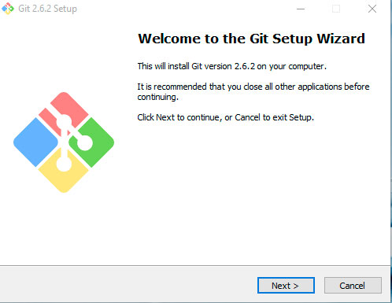
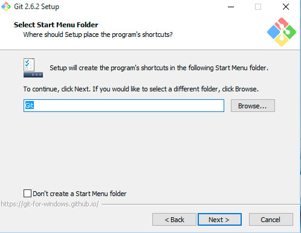
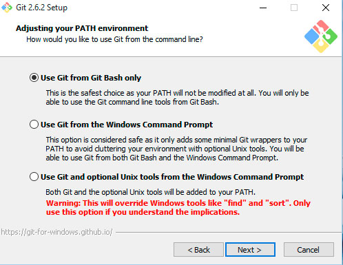
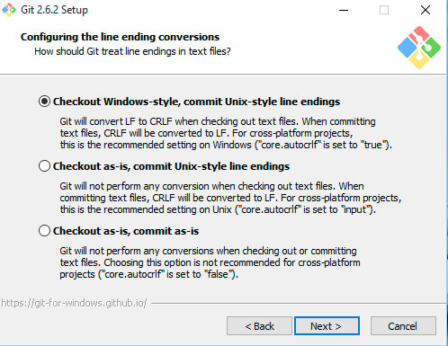
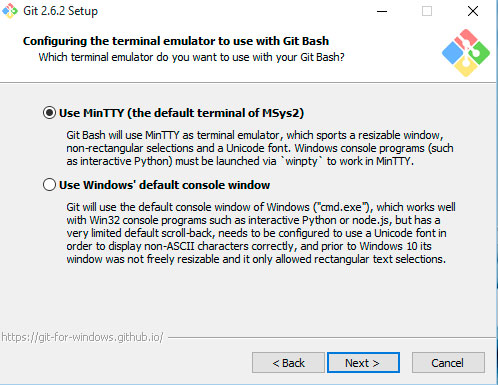
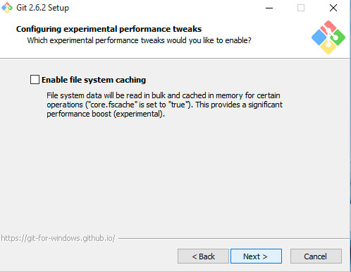
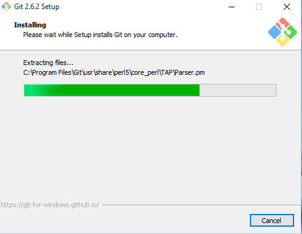

# Versionamento e GIT

Tanto no desenvolvimento de sistemas para web quanto na criação de websites, é muito importante que você saiba versionar os seus arquivos. Mesmo que você seja uma pessoa regrada e que faça backup do seu site/aplicativo todos os dias em Pendrivers ou deixe-os na nuvem, como o DropBox, o gerenciamento dessas versões é impraticável. Você nunca se lembra o que foi feito na semana passada e se algo quebrar, você precisa comparar os arquivos manualmente para descobrir o código que gerou o bug. 

Versionar arquivos é uma tarefa básica e trivial que todos nós devemos ser capazes de executar sem pestanejar.

Se você usa Windows, eu tenho uma notícia boa e uma má para você. A boa: há uma ferramenta que faz o versionamento através de uma interface gráfica muito elegante. É bem simples mexer e você adoraria trabalhar com ela. A má: nós não vamos nem chegar perto dessa ferramenta. Motivo: no começo, eu também me senti atraído por poder versionar meus arquivos sem a necessidade de digitar linhas de comandos. O problema é que com o tempo você percebe que precisa ter um maior controle sobre esse versionamento, e esta ferramenta que deveria facilitar a tua vida acaba se tornando um problema. Além do mais, trabalhar com o Git por linha de comando é moleza, você vai ver.

Dito isto, quero explicar a base sobre os sistemas de versão. 

Um sistema de versionamento que se preze precisa efetuar bem duas tarefas:
1. Armazenar registros temporais da evolução de seu sistema. É como se você conseguisse tirar uma fotografia do seu projeto num determinado instante e inserir uma legenda nessa fotografia. Essa ‘legenda’ é chamada de commit. Cada commit é um registro do seu projeto numa linha de tempo.
2. Gerenciar conflitos em um mesmo arquivo se este for editado por mais de uma pessoa ao mesmo tempo. Muitas vezes o Git é capaz de lidar com esses conflitos de maneira espetacular. Outras vezes o Git não sabe qual é a versão correta, e então os desenvolvedores envolvidos devem decidir qual é a versão que deve ficar para a história do projeto. 

## Instalando

Para instalar o Git para windows, acesse [https://git-for-windows.github.io/](https://git-for-windows.github.io/) e faça do download do executável. No momento da escrita deste texto, o Git para windows estava na versão 2.6.2.

Siga as imagens abaixo para terminar sua instalação

Na tela acima deixe marcada somente a primeira opção. Isto é mais seguro, pois fará que o git seja usado somente a partir do Git Bash.

Já a tela acima é sobre quebra de linhas. Como os sistemas operacionais possuem formatos diferentes de quebra de linhas em aquivos de texto, deixar marcada a primeira opção normaliza isto. Explicando: a primeira opção converte para o padrão Windows quando os arquivos chegam até você. Quando você efetuar um commit será convertido para o formato Unix.  A segunda não faz nenhuma conversão quando o arquivo chega, apenas converte para Unix quando comitamos. Já a terceira opção não faz nenhum tipo de conversão. Deixe marcada a primeira opção.

 

 

 

Agora que temos o git instalado e configurado, na próxima seção vamos dar uma olhada rapidamente em alguns comandos Unix para manipulação de arquivos.
