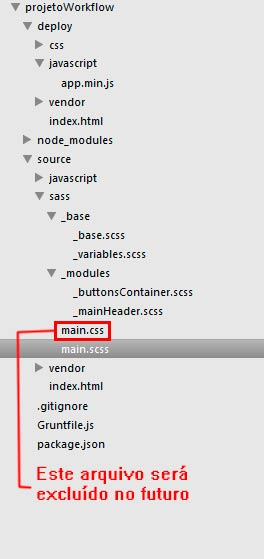

#Aplicando Sass em nosso projeto

Uma das principais vantagens em usar algum pré-processador de CSS é podermos modularizar a nossa folha de estilo em diversos arquivos independentes. A metodologia BEM, aplicada em nosso projeto, é meio caminho andado para separar responsabilidades de cada um dos componentes, deixando-os isolados e com formatações visuais bem definidas. 

Em nosso projeto, tenho apenas dois componentes:

* mainHeader
* buttonsContainer

Em termos de estrutura de arquivos dentro de uma metodologia de desenvolvimento, eu poderia ter estes componentes inseridos em um diretório chamado _modules.

Existem várias maneiras de organizar seus arquivos sass. Vale dar uma pesquisada na internet sobre como organizar estes arquivos ou inventar uma maneira própria. Não há regras. Mas o que se vê muito por aí é termos, basicamente, três principais diretórios:
* _modules/ - armazena a formatação de componentes independentes, como por exemplo, carousel, modal, accordion etc. Por serem independentes, estes componentes não devem sofrer alterações visuais se você alterar a posição deles no seu HTML. Tanto faz se o seu caroussel estiver numa section, num article ou numa div. O resultado deve ser o mesmo.
* _partials/ - aqui é onde armazenamos as informações da estrutura do site. Os arquivos dessa pasta devem ser responsáveis pela formatação da grid, do header, do footer etc.
* _base/ - aqui é onde criamos as configurações principais do site. Definimos as cores, as fontes, os css resets etc.

Como eu falei, não há uma regra. Sinta-se livre para modificar essa estrutura à vontade.


Irei criar  dentro da pasta sass de nosso projeto apenas dois diretórios: _base e _modules. dentro de _base irei criar dois arquivos: _variables.scss e _base.scss. Dentro de _modules criarei também dois arquivos: _mainHeader.scss e _buttonsContainer.scss. Na raiz, criarei o main.scss (sem o underline). 

Arquivos que contenham o underline inicial não serão compilados em arquivos CSS, ou seja, eles só podem ser importados para outros arquivos.

Dentro de sass/ há um arquivo main.css. Não vamos mais utilizar esse arquivo, mas vou deixá-lo aí apenas para referência. No final desse tópico podemos apagá-lo sem problemas.

Segue uma imagem de como deve ficar a estrutura de arquivos.





Antes de começarmos a ver o Sass em ação, vou fazer uma pequena alteração em nosso Gruntfile. 

Anteriormente, o autoprefixer usava o arquivo source/sass/main.css como base para salvar o novo deploy/css/main.css. Veja como era o nosso Gruntfile:

```javascript

autoprefixer: {		    
		    dist: {
		       files: {
		             'deploy/css/main.css': 'source/sass/main.css',
		       },
		    },
		},


```


Só que agora não há mais arquivo .css, ou pelo menos não haverá no futuro. Por isso, farei a seguinte alteração:

```javascript

autoprefixer: {		    
		    dist: {
		       files: {
		             'deploy/css/main.css': 'deploy/css/main.css',
		       },
		    },
		},


```

Repare que o arquivo de origem e destino é o mesmo. Quem irá gerar o mais.css será o Sass antes da tarefa autoprefixer ser executada.

Precisamos, portanto, incluir a tarefa do sass.

```javascript
sass: {		    
		    dist: {
		       files: {
		              'deploy/css/main.css': 'source/sass/main.scss',
		       },
		    },
		},


```

Além disso, se você ainda não o fez, vamos carregar o grunt-contrib-sass:


```javascript

grunt.loadNpmTasks('grunt-contrib-sass');

```

E registrá-lo em nossa lista de tarefas:

```javascript
grunt.registerTask('deploy', ['clean', 'sass', 'autoprefixer', 'cssmin', 'uglify', 'copy'])
```

No final, o nosso Gruntfile deve ficar semelhante à:


```javascript

module.exports = function(grunt) {
	'use strict';

	grunt.initConfig({
		sass: {		    
		    dist: {
		       files: {
		              'deploy/css/main.css': 'source/sass/main.scss',
		       },
		    },
		},
		autoprefixer: {		    
		    dist: {
		       files: {
		             'deploy/css/main.css': 'deploy/css/main.css',
		       },
		    },
		},

	    copy: {
		  dist: {
		  	files: [
			  	{
			  		expand: true, //habilita o cwd
			  		cwd: 'source/',	//relativo à source, mas não a inclui na cópia	  	
			  		src: 'vendor/*', 
			  		dest: 'deploy/'
			  	},
			  	{
			  		expand: true, //habilita o cwd
			  		cwd: 'source/',
			  		src: 'index.html', 
			  		dest: 'deploy/'}
			]        
		  }
		},		

	    clean: {
  			dist: {
    			src: ["deploy"]
  			}
		},

	    cssmin: {
		    dist: {
			 files: {
		          'deploy/css/main.css': 'deploy/css/main.css'
		       }
		    }
		},

	    uglify: {
		    options: {
		      mangle: true
		    },

		    dist: {
		      files: {
		        'deploy/javascript/app.min.js': [
		        'source/javascript/incrementButton.js', 
		        'source/javascript/date.js'
		        ]
		      }
		    },
		}


	});

    
    grunt.loadNpmTasks('grunt-autoprefixer');
    grunt.loadNpmTasks('grunt-contrib-sass');
    grunt.loadNpmTasks('grunt-contrib-cssmin');
    grunt.loadNpmTasks('grunt-contrib-uglify');
    grunt.loadNpmTasks('grunt-contrib-copy');
    grunt.loadNpmTasks('grunt-contrib-clean');

    grunt.registerTask('deploy', ['clean', 'sass', 'autoprefixer', 'cssmin', 'uglify', 'copy'])


}


```