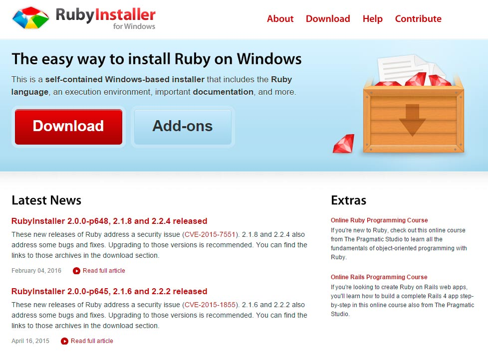
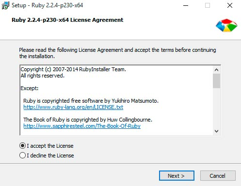
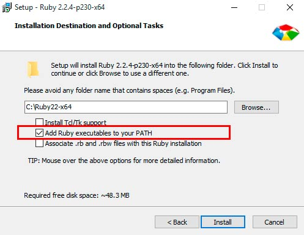

#O que é preciso para começar?
Antes de tudo, precisamos escolher um pré-processador de CSS para dar início à esta etapa do nosso workflow. Há três que dominam o mercado, o [Stylus](http://stylus-lang.com/), o [Less](http://lesscss.org/) e o [Sass](http://sass-lang.com/). 

O Sass é, atualmente, o mais usado e é o que eu vou utilizar nesse guia, mas tenha em mente que os conceitos mostrados aqui são válidos para qualquer pré-processador que você venha a escolher.

Pense num pré-processador de CSS como sendo um software que recupera um código escrito em um formato diferente e o transforma na boa e velha folha de estilo em cascata , ou seja, você escreve num arquivo contendo outra extensão e o compilador gera o CSS comum. A vantagem é que com um pré-processador você ganha features que não estão disponíveis nativamente num CSS, como variáveis (mentira: [http://caniuse.com/#feat=css-variables](http://caniuse.com/#feat=css-variables)), loops, if e else, entre outras coisas legais.

É importante salientar que há duas formas de escrevermos com o Sass. Há a sintaxe.sass (um pouco diferente do CSS tradicional. É baseado em indentações e quebras de linha) e o .scss (parecido com o CSS que estamos acostumados, por isso mesmo, é a minha sintaxe preferida. Esta sintaxe é baseada em chaves e ponto-e-vírgulas).

Além de escolhermos nosso pré-processador e também a sintaxe, precisamos decidir qual a ferramenta que vamos utilizar para transformar nossos arquivos .scss em .css. Há o [Ruby](http://rubyinstaller.org/) e o [Libsass](http://libsass.org/).

Originalmente, o Sass foi criado baseado em Ruby, porém, posteriormente surgiu o Libsass, escrito em C. O fato é que o compilador escrito em Ruby possui um melhor suporte às novas features, e por esse motivo será a minha escolha nesse guia (atualmente, início de 2016, acho que isto está mudando. Me senti tentado a escrever esse guia usando Libsass pela facilidade de não termos que instalar o Ruby, mas como tenho trabalhado com esta ferramenta de maneira satisfatória, darei preferência à ela).

Antes de qualquer coisa, como estamos num ambiente windows, precisamos instalar o Ruby. Vá em [http://rubyinstaller.org/](http://rubyinstaller.org/) e faça o download. Depois... Ah!, você já sabe o que fazer.





Mas atenção: Habilite a opção para adicionar uma variável PATH. Sem essa opção habilitada, você não conseguirá rodar o Sass da maneira como queremos.



Depois de instalado, abra o terminal do Ruby (isso é importante). É a partir dele que iremos instalar o Sass. Digite:

```
gem install sass

```

Talvez seja necessário digitar o comando acima com permissão de administrador usando a palavra ```sudo```.

```
sudo gem install sass

```

Veja se tudo correu bem digitando

```
sass -v

```

Você deve visualizar a versão do sass instalado na sua máquina.

---

Se você optar por compilar seus arquivos usando o Libssas, não precisará instalar o Ruby. Nesse caso, como estamos usando o node, você precisará instalar um wrapper chamado [node-sass](https://github.com/sass/node-sass). Veja mais detalhes [nesse link](http://sass-lang.com/libsass). 

---


Se você, assim como eu, instalou o Ruby e o Sass da maneira como descrevi acima, você será capaz de transformar seus arquivos .scss em .css através do próprio terminal do ruby. É algo muito simples. Basta digitar no terminal do ruby:

```
sass arquivo-fonte.scss arquivo-compilado.css
```

Porém, não entrarei em maiores detalhes sobre isso. A ideia é conseguirmos compilar nossos arquivos através do GruntJS e não através do terminal. Para isso, feche o seu terminal do ruby e abra o Git Bash. Como você já deve saber, precisamos instalar um wrapper do sass para o GruntJS, então…

```
$ npm install grunt-contrib-sass --save-dev
```

Depois disso, precisamos registrar essa tarefa no nosso Gruntfile.js

```
grunt.loadNpmTasks(‘grunt-contrib-sass’)
```

Para configurar o Sass dentro de nosso Gruntfile, temos duas opções:

###Opção 1 (simplificada):

```javascript

sass: {
    dist: {
        files: {
            'arquivo-compilado.css': 'arquivo-original.scss'
        }
    }
}

```


###Opção 2 (mais parruda):

```javascript

sass: {
    dist: {
        files: [{
                    expand: true, //você já sabe o que isso faz
                    cwd: 'source/sass', // você também já sabe o que isso faz.
                    src: ['**/*.scss'], // onde estão os arquivos fontes
                    dest: 'deploy/css', // pasta de destino.
                    ext: '.css' // extensão do arquivo final.
                }]

    }
}
```


Além disso, podemos passar algumas opções ao compilador. Veja:


###Opção 1 (simplificada - com opções):

```javascript

sass: {
    dist: {
        options: {
	        //opções de configuração
        },
        files: {
            'arquivo-compilado.css': 'arquivo-original.scss'
        }
    }
}

```


###Opção 2 (mais parruda - com opções):

```javascript

sass: {
    dist: {
        options: {
	        //opções de configuração
        },
        files: [{
                    expand: true, //você já sabe o que isso faz
                    cwd: 'source/sass', // Você também já sabe o que isso faz.
                    src: ['**/*.scss'], // onde estão os arquivos fontes
                    dest: 'deploy/css', // pasta de destino.
                    ext: '.css' // extensão do arquivo fina.
                }]

    }
}
```


No próximo tópico vamos aplicar todo esse conhecimento no nosso projeto. Até lá!


