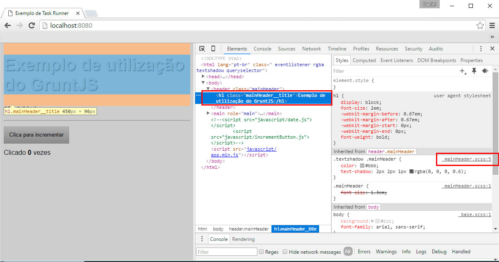

##Entendendo o arquivo .map
Coisa linda. Se tudo correu bem, temos um main.css compilado e um arquivo novo chamado main.css.map. Este arquivo é usado para debugar o código (você já deve ter se deparado com esse arquivo em bibliotecas como o jquery). Ele não deve ser levado para produção. Além disso, a referência /*# sourceMappingURL=main.css.map */ deve estar presente apenas no ambiente de desenvolvimento. 

Por enquanto, vou deixar o arquivo .map sendo criado normalmente. Em breve iremos configurar o sass para não gerar esse sourceMap.

Se você inspecionar o seu html pelo Chrome (em um servidor, pois o sourceMap não funciona em file://…) você verá que o Browser mostra a referência ao arquivo .scss e não ao .css, como era esperado. Assim, quando você tiver muitos arquivos, muitos componentes, muitas partials etc, ficará fácil saber quem é o sass responsável por aquela formatação. Se não existisse o .map, você teria que avaliar o arquivo compilado e "caçar" nos arquivos fontes. Isso seria uma grande perda de tempo.

O arquivo de extensão .map serve para nos ajudar no ambiente de desenvolvimento. Conforme podemos observar, ao inspecionar um elemento html, o web inspector do google chrome nos mostra o arquivo fonte .scss, e não o .css compilado. Isso é muito útil quando tivermos muitos componentes gerando um único e extenso arquivo final. 
