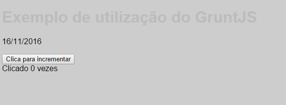

## Referência ao seletor pai

O nosso próximo passo é incluirmos o componente mainHeader. Para isso, crie o seguinte código em _modules/_mainHeader.scss

```css

.mainHeader{
    color: #bbb;
    text-shadow: 2px 2px 1px rgba(0,0,0,.6);
}


```
Em seguida, importe-o no main.scss e rode novamente $ grunt sass

Nada de novo aqui. Porém, a grande sacada é que, mesmo que você não goste do IE, precisa gostar dos usuários que o utilizam, assim como Deus abomina o pecado, mas ama o pecador. 

Sabemos que text-shadow [não funciona em IE antigo](http://caniuse.com/#search=text-shadow), e sinceramente, eu nem ligo. Mas o que eu não posso permitir é que os usuários do IE9 ou mais velhos tenham acesso prejudicado ao conteúdo simplesmente por utilizarem browsers antigos.



Conforme podemos observar, a legibilidade do título é prejudicada quando o browser não tiver suporte ao text-shadow. Ou seja, nestes casos, precisamos mostrar o texto com uma fonte um pouco mais escura.

Para resolver essa questão, vou utilizar o símbolo ‘&’ que representa um seletor pai, juntamente com o modernizr que inserimos lá no começo do nosso guia.

Edite o arquivo da seguinte forma:

```css

.mainHeader{

	font-size: 1.2em;

	.textshadow &{
		color: #bbb;
    	text-shadow: 2px 2px 1px rgba(0,0,0,.6);
	}
    
    .no-textshadow &{
    	color: #717171;
    }
}


```

Incluí propositalmente um font-size para você avaliar o resultado. Abra o arquivo main.css em deploy e veja o que representa o sinal ‘&’. Perceba que fica muito mais fácil dar manutenção. Você pode até não se dar conta disso agora, mas tente implementar esse conceito no próximo código que você precisar escrever.

Repare que no exemplo acima eu também aninhei seletores do CSS, algo muito usado (mas que também pode se tornar um pesadelo se não for usado com cautela). Veremos isso daqui a dois segundos.


